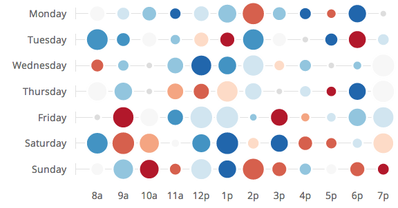

# d3.chart.bubble-matrix

A bubble-matrix chart, working on any kind of bidimensional data.



## Sample Use

We assume `d3`, `lodash`, `d3.chart` and `d3.chart.base` libraries files are in
the same directory as the example.

```html
<!-- index.html -->
<!DOCTYPE html>
<html>
    <head>
        <script src="d3.js"></script>
        <script src="lodash.js"></script>
        <script src="d3.chart.js"></script>
        <script src="d3.chart.base.js"></script>
        <script src="d3.chart.bubble-matrix.js"></script>
        <link rel="stylesheet" type="text/css"
              href="d3.chart.bubble-matrix.css">
        <link rel="stylesheet" type="text/css"
              href="d3.chart.bubble-matrix.default.css">
    </head>
    <body>
        <div id='vis'>
        <script src="data.js"></script>
        <script src="example.js"></script>
    </body>
</html>
```

```js
/*! example.js */
var chart = d3.select('#vis').append('svg')
              .chart('BubbleMatrix')
              .width(400).height(200);

chart.draw(exampleData);
```

```js
/*! data.js */
var exampleData = {
    columns: ['the', 'cake', 'is', 'a', 'lie'],
    rows: [
        {name: 'foo', values: [[0.13, 0.69], [0.84, 0.49], [0.31, 0.97],
                               [0.75, 0.29], [0.64, 0.9]]},
        {name: 'bar', values: [[0.98, 0.96], [0.13, 0.7], [0.27, 0.64],
                               [0.17, 0.24], [0.94, 0.3]]},
        {name: 'baz', values: [[0.94, 0.1], [0.39, 0.63], [0.07, 0.27],
                               [0.98, 0.02], [0.25, 0.94]]},
        {name: 'glo', values: [[0.3, 0.14], [0.39, 0.4], [0.54, 0.23],
                               [0.35, 0.47], [0.71, 0.71]]}
    ]
}
```

This will draw a simple bubble matrix, with the default color palette.
You can find this example in the [example/minimal](/example/minimal) folder.

When nothing is configured except `width` and `height`, the library makes a lot
of assumptions about how is organized your data. However, you can customize a
lot data organization with the provided interface.

To play with the example in live, clone the repo, grab the packages `npm
install`, run `grunt dev` and go to http://localhost:8000/. See also
[CONTRIBUTING](CONTRIBUTING.md).

## API

### Methods

##### `<instance>.draw(data)`

Draw the chart with the specified data.

### Properties

Each configuration function returns the current value or the property when
called with no argument, set the value otherwise.

##### `<instance>.rows([fn])`

The function `fn` is called with `(data)` and must return an `Array` of
rows. By default this is set to `function(d) { return d.rows; }`. This is a
required property.

---

##### `<instance>.rowHeader([fn])`

The function `fn` is called `(datum)` for each row and must return a `String`
to be displayed as the row header. By default this is set to `function(d)
{ return d.name; }`. This is a required property.

---

##### `<instance>.rowKey([fn])`

The function `fn` is called `(datum)` for each row and must return a `String`
that identifies uniquely the row. When rows are updated by subsequent calls to
`draw`, rows will be removed, added; or updated/moved when a key match an
existing row. This is an optional property and is `null` by default.

---

##### `<instance>.rowData([fn])`

The function `fn` is called `(datum)` for each row and must return an `Object`
containing bubble data for this row. This is a required property.

---

##### `<instance>.columns([fn])`

The function `fn` is called with `(data)` and must return an `Array` containing
each column data. By default this is set to `function(d) { return d.columns;
}`. This is a required property.

Note you don't specifically have to store the column data array into the data
provided to `draw`. You can build directly the column data in this function if
you wish. For instance, in `example/example.js`, we build column information
from a range stored in the data:

```js
chart.columns(function (d) { return d3.range(d.dayHours[0],
                                             d.dayHours[1]); })
     .colKey(function(d) { return d; })
     .colHeader(utils.hourName)
```

---

##### `<instance>.colHeader([fn])`

The function `fn` is called `(datum)` for each column and must return a
`String` to be displayed as the column header. By default this is set to
`function(d) { return d; }`. This is a required property.

---

##### `<instance>.colKey([fn])`

The function `fn` is called `(datum)` for each column and must return a
`String` that identifies uniquely the column. When columns and bubbles are
updated by subsequent calls to `draw`, columns will be removed, added; or
updated/moved when a key match an existing column. This is an optional property
and is `null` by default.

---

##### `<instance>.size([fn])`

The function `fn` is called `(datum)` for each bubble and must return a
`Number` driving the bubble sizes. By default this is set to `function(d) {
return d[0]; }`. This is a required property.

---

##### `<instance>.color([fn])`

The function `fn` is called `(datum)` for each bubble and must return a
`Number` driving the bubble color. By default this is set to `function(d) {
return d[1]; }`. This is a required property.

Note, if you want, you can return a fixed value and only use the size
feature of the bubbles; or, you can return a value correlated with the
size.

---

##### `<instance>.sizeDomain([value])`

Set the domain of the values returned by `size` to be `value`. `value` must
be an `Array` containing the min and max of acceptable values. By default this
is set to `[0, 1]`. This is a required property.

The actual radius of the bubbles is the square root of the size obtained after
normalization. This ensures one bubble *area* to represent accurately the size.

---

##### `<instance>.colorScale([fn])`

Set the color scale used to translate color values to actual colors. A scale
is just a function called with `(value)` and that must return a color. You may
want to create the scale with d3.js, eg:

```js
var palette = ['#ff0000', '#00ff00', '#0000ff']

chart.colorScale(d3.scale.quantize().domain([0,1])
                   .range(palette);
```

A default color scale from red to blue is provided. This is a required
property.

### Events

##### `margin(value)`

Sent when the left margin width changes with:

  * `value` {Number} the margin width;
  * `this` the chart itself.

It is useful to align the SVG element on your paragraphs. Example:

```js
var chart = d3.select('#vis').append('svg')
              .chart('BubbleMatrix');

chart.on('margin', function(value) {
    this.base.style('margin-left', '-' + value + 'px');
});
```

The value `base` in the chart is the root d3 selection, generally the SVG.

## Compatibility and Limitations

  * Tested on Chrome 30, Firefox 22 and IE10;
  * does not resize the headers font, if the chart is dynamically resized to be
    tiny, it won't be very good (but you can change the font with CSS);
  * does not support -- yet -- slanted headers;
  * animations can become slow if you have a lot of bubbles displayed.

Please, feel free to open pull requests to make any change.
See [CONTRIBUTING](CONTRIBUTING.md).
